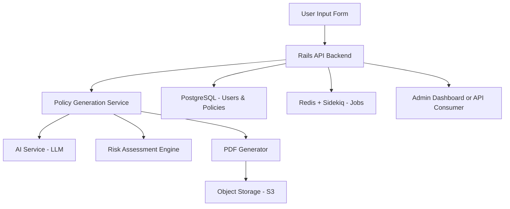

# AI-Powered Policy Builder (Ruby on Rails Backend)

## 🧠 Overview
A scalable backend system that creates personalized insurance policies using AI. The system integrates a Rails API with background job processing, PDF generation, and AI-powered policy drafting.

---

## 🧱 Architecture Diagram (High-Level)



---

## 🚀 How to Run Locally

```bash
git clone https://github.com/YOUR_USERNAME/ai_policy_builder.git
cd ai_policy_builder
bundle install
yarn install # if using frontend too
cp .env.example .env
rails db:setup
foreman start # starts web and worker (requires Procfile)
```

> You'll need a `.env` file with your API keys and Redis credentials. Example:

```dotenv
OPENAI_API_KEY=your-key-here
REDIS_URL=redis://localhost:6379
SECRET_KEY_BASE=generate-with-rails-secret
```

---

## 🧩 Core Technologies

- **Ruby on Rails (API-only mode)**
- **PostgreSQL** – user and policy data
- **Redis + Sidekiq** – background job queue
- **WickedPDF / Prawn** – PDF generation
- **Devise + JWT** – authentication
- **Pundit** – authorization
- **HTTParty** – AI API integration
- **RSpec + FactoryBot** – testing
- **Swagger (rswag)** – API docs

---

## 🔁 API Endpoints

```http
POST /generate-policy
Input: { userData, insuranceType }
Response: { policyId, summary }

GET /policy/:id
Returns full policy document (PDF/JSON)

POST /feedback
Send clause or risk preference for re-generation

POST /finalize
Locks and archives the policy document
```

---

## 🧠 AI Prompt Example

```json
{
  "user": {
    "age": 37,
    "location": "California",
    "assets": ["house", "car"],
    "income": 120000
  },
  "insurance_type": "property",
  "goals": ["flood protection", "liability"]
}
```

Prompt template: _"Based on the following profile, draft a property insurance policy that covers the user's goals and highlights uncovered risks..."_

---

## 📄 Sample Generated Policy (Summary)

```yaml
policy_id: POL1234
user_id: 7
coverage:
  - dwelling: $500,000
  - personal_property: $100,000
  - liability: $300,000
premium: $2,350/year
clauses:
  - Flood damage not covered unless rider is added.
  - Earthquake damage not included.
status: draft
```

---

## 📂 Repo Structure

```
app/
├── controllers/
├── models/
├── services/
│   └── ai_policy_generator.rb
├── jobs/
│   └── policy_generator_job.rb
├── policies/ # Pundit
├── pdf_templates/
config/
db/
lib/
public/
spec/
```

---

## 🧪 Testing

```bash
bundle exec rspec
```

Includes model, request, and service layer specs.

---

## 🧰 Future Enhancements
- Human-in-the-loop clause editor
- Real-time collaboration via ActionCable
- Voice-to-policy transcription
- Admin dashboard with analytics
- Policy versioning / diff viewer

---

## 🔒 Security
- Devise JWT auth
- Role-based access (Pundit)
- CSRF protection
- Encrypted PDF URLs via ActiveStorage
- GDPR-compliant audit logging

---

## 📈 Monitoring & DevOps
- Heroku or Render deployment-ready
- Procfile setup for Sidekiq & Web
- Skylight / New Relic integration (optional)
- GitHub Actions CI

---

## 🏁 Status
✅ MVP complete — AI policy generation with customizable clauses, PDF output, and secure user handling.

---

Feel free to fork this repo and extend the AI logic or build a polished frontend on top!
