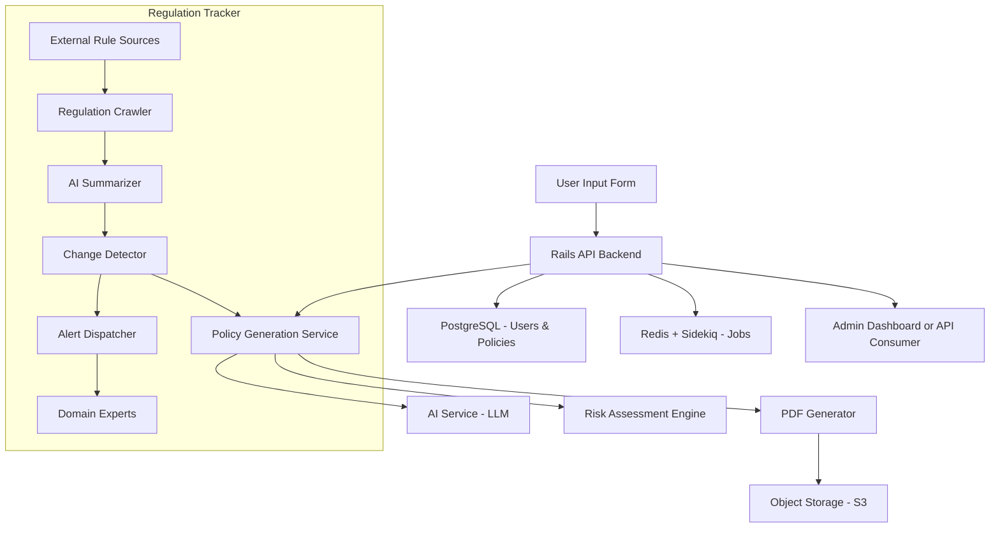

# AI-Powered Policy Builder & Regulation Tracker (Ruby on Rails Backend)

## 🧠 Overview
A scalable backend system that creates personalized insurance policies using AI, and now includes a powerful regulatory monitoring feature. The system:
- Uses AI to generate and customize insurance policies.
- Periodically monitors external sources for rule/regulation updates.
- Summarizes changes and notifies domain experts.
- Optionally recommends policy adjustments based on legal/regulatory changes.

---

## 🧱 Architecture Diagram (High-Level)



---

## 🚀 How to Run Locally

```bash
git clone https://github.com/YOUR_USERNAME/ai_policy_builder.git
cd ai_policy_builder
bundle install
yarn install # if using frontend too
cp .env.example .env
rails db:setup
foreman start # starts web and worker (requires Procfile)
```

> You'll need a `.env` file with your API keys and Redis credentials. Example:

```dotenv
OPENAI_API_KEY=your-key-here
REDIS_URL=redis://localhost:6379
SECRET_KEY_BASE=generate-with-rails-secret
```

---

## 🧩 Core Technologies

- **Ruby on Rails (API-only mode)**
- **PostgreSQL** – user and policy data
- **Redis + Sidekiq** – background job queue
- **WickedPDF / Prawn** – PDF generation
- **Devise + JWT** – authentication
- **Pundit** – authorization
- **HTTParty** – AI API integration
- **RSpec + FactoryBot** – testing
- **Swagger (rswag)** – API docs

---

## 🔁 API Endpoints

```http
POST /generate-policy
Input: { userData, insuranceType }
Response: { policyId, summary }

GET /policy/:id
Returns full policy document (PDF/JSON)

POST /feedback
Send clause or risk preference for re-generation

POST /finalize
Locks and archives the policy document

POST /regulation-crawl
Triggers external rule crawler (admin only)
```

---

## 🧠 AI Prompt Example

```json
{
  "user": {
    "age": 37,
    "location": "California",
    "assets": ["house", "car"],
    "income": 120000
  },
  "insurance_type": "property",
  "goals": ["flood protection", "liability"]
}
```

Prompt template: _"Based on the following profile, draft a property insurance policy that covers the user's goals and highlights uncovered risks..."_

---

## 📄 Sample Generated Policy (Summary)

```yaml
policy_id: POL1234
user_id: 7
coverage:
  - dwelling: $500,000
  - personal_property: $100,000
  - liability: $300,000
premium: $2,350/year
clauses:
  - Flood damage not covered unless rider is added.
  - Earthquake damage not included.
status: draft
```

---

## 📂 Repo Structure

```
app/
├── controllers/
├── models/
├── services/
│   └── ai_policy_generator.rb
│   └── regulation/
│       ├── crawler.rb
│       ├── summarizer.rb
│       ├── change_detector.rb
│       └── alert_dispatcher.rb
├── jobs/
│   └── policy_generator_job.rb
│   └── regulation_monitor_job.rb
├── policies/ # Pundit
├── pdf_templates/
config/
db/
lib/
public/
spec/
```

---

## 🧪 Testing

```bash
bundle exec rspec
```

Includes model, request, and service layer specs.

---

## 🧰 Future Enhancements
- Human-in-the-loop clause editor
- Real-time collaboration via ActionCable
- Voice-to-policy transcription
- Admin dashboard with analytics
- Policy versioning / diff viewer
- Regulation dashboard and notification center

---

## 🔒 Security
- Devise JWT auth
- Role-based access (Pundit)
- CSRF protection
- Encrypted PDF URLs via ActiveStorage
- GDPR-compliant audit logging

---

## 📈 Monitoring & DevOps
- Heroku or Render deployment-ready
- Procfile setup for Sidekiq & Web
- Skylight / New Relic integration (optional)
- GitHub Actions CI

---

## 🏁 Status
✅ MVP complete — AI policy generation with customizable clauses, PDF output, and secure user handling.
🚧 Regulatory monitoring system now integrated — crawling, summarization, change detection and expert notifications.

---

## 🛠️ Replication Guide (From Scratch)

### 1. Initialize Rails API Project
```bash
rails new ai_policy_builder --api -d postgresql
cd ai_policy_builder
```

### 2. Add Core Gems
To your `Gemfile`:
```ruby
gem 'devise'
gem 'jwt'
gem 'pundit'
gem 'sidekiq'
gem 'redis'
gem 'dotenv-rails'
gem 'httparty'
gem 'wicked_pdf' # or 'prawn'
gem 'rspec-rails'
gem 'factory_bot_rails'
gem 'rswag'
```
Then:
```bash
bundle install
rails generate rspec:install
rails generate devise:install
rails generate pundit:install
```

### 3. Set Up Your Models
- `User` (Devise-based)
- `Policy` (JSONB or structured fields)
- Optional: `RiskProfile`

### 4. Create Services
- `AI::PolicyGenerator` – talks to AI APIs
- `PolicyGeneratorJob` – background async processing
- `Regulation::Crawler`, `Summarizer`, `ChangeDetector`, `AlertDispatcher`

### 5. Configure PDF Generator
Choose WickedPDF or Prawn:
```bash
rails generate wicked_pdf
```
Use ERB or HAML templates for rendering.

### 6. Routes & Controllers
Implement:
- `POST /generate-policy`
- `GET /policy/:id`
- `POST /feedback`
- `POST /finalize`
- `POST /regulation-crawl`

### 7. Run and Test
```bash
rails db:create db:migrate
foreman start
```

### 8. Use Mermaid Diagram in README
Paste this in:
```markdown

```
---

## 📌 General System Design Principles Applied

### ✅ Functional Requirements
- Generate personalized policies
- Summarize new rules and regulations
- Notify experts automatically
- Download finalized PDFs securely

### ✅ Non-Functional Requirements
- **Scalability**: Sidekiq jobs, Redis queues, modular services
- **Security**: JWT, role-based access, encrypted storage
- **Performance**: Async AI calls, low-latency PDF serving
- **Availability**: Retry logic, queue separation, stateless API
- **Maintainability**: Service-based logic, clean controllers

### ✅ Design Patterns Used
- **Service Objects** (business logic extraction)
- **Jobs & Background Workers** (Sidekiq)
- **Separation of Concerns** (controllers, services, models, jobs)
- **Policy Objects** (via Pundit)

### ✅ AI Integration Strategy
- Prompt templates for consistency
- LLM used via HTTP (OpenAI or hosted model)
- Regulation updates pre-processed and diffed

### ✅ Communication
- Alerts via email, Slack, or in-app messages
- Background jobs decouple user experience from system load
- All steps logged for traceability & audit

---

You're now ready to build and iterate. 🚀
